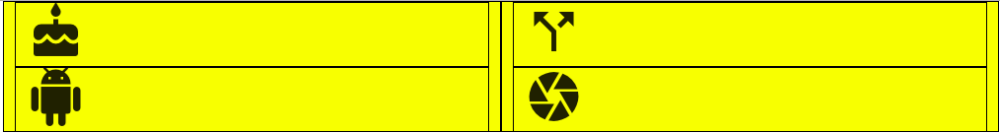
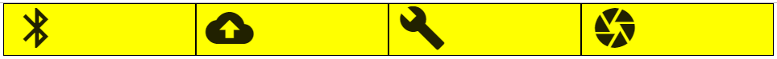
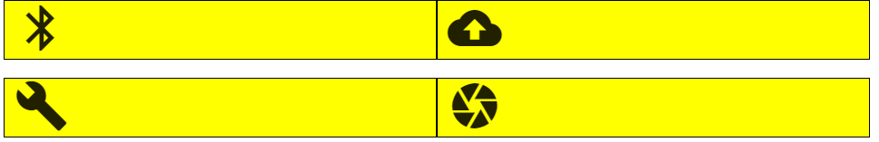
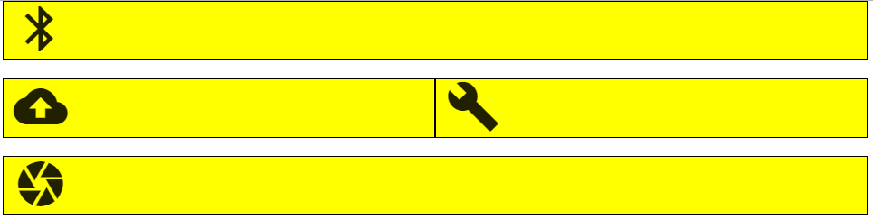
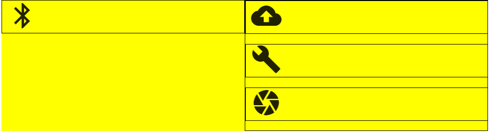
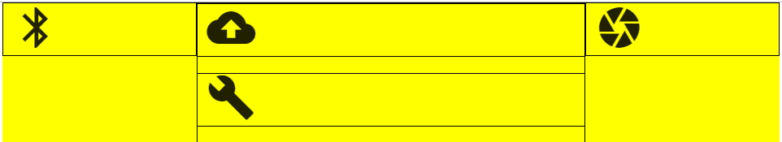

# NY State Education Data - React Props

## The Goal
In this lab, you will practice various complex layouts to build up the crucial skill of nesting rows and columns. You'll also gain comfort using Materialize Icons, which provide important visual cues to users.

### Getting Started

1. Clone this repository using `git clone`
2. `cd` into the `materialize-grid-icon` folder
3. Open the file `index.html` and preview it. You should see something that looks a lot like the photo above. It is worth noting that every row has a yellow background and every column has a black outline.

## The Lab
1. Head to <a href="https://materializecss.com/icons.html">Materialize Icons</a> and substitute the four icons in index.html with four of your choosing. Do not change any of the divs, just the `<i>` tags.
2. Using Materialize's Grid, arrange the icons as follows:

3. Using Materialize's Grid, arrange the icons as follows:

4. Using Materialize's Grid, arrange the icons as follows:

5. Using Materialize's Grid, arrange the icons as follows:

6. Using Materialize's Grid, arrange the icons as follows:

### Stretch
1. Adding as many rows, columns, and icons as you'd like, create your own challenge and swap with a friend! 
